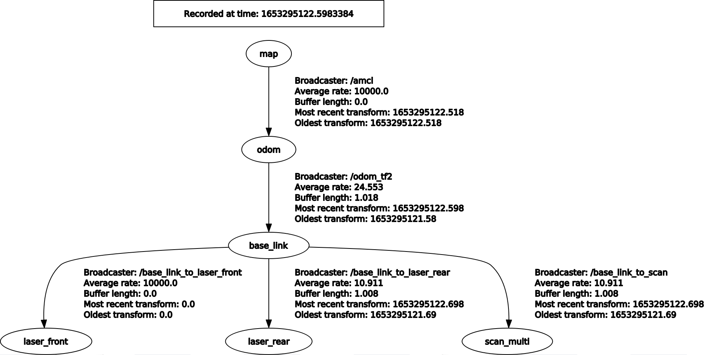
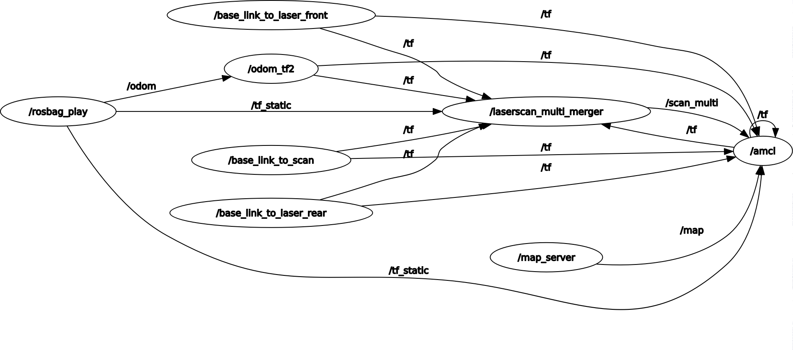

# Polimi-Robotics-Project-2
Second university project for robot navigation and localization using ROS middleware and data acquired with lidar and wheels encoders sensors

rosrun map_server map_saver -f name_of_the_map


# Robotics Project 2 - Academic Year 2021/2022

<p align="center">
  
  <br>
</p>

## Contributors

- [__Marco D'Antini__](https://github.com/DantiniMarco) (10603556)
- [__Simone Giampà__](https://github.com/SimonGiampy) (10659184)


## Project structure

|Directory|File|Description|
|---------------|---------|-----------|
| /bags |  `robotics1_final.bag` | bag used for gmapping
|  |  `robotics2_final.bag`| bag used for localization 
|  |  `robotics3_final.bag`| bag used for localization 
| /cfg | `amcl.xml` | configuration file for amcl localization 
|  | `gmapping.xml` | configuration file for gmapping 
| /launch | `amcl.launch` | launch file for amcl 
|  | `gmapping.launch` | launch file for gmapping 
|  | `scan_merger.launch` | launch file used to merge the two laser scans, called by both amcl and gmapping
| /maps | `map1.pgm` | the map built with gmapping 
|  | `map1.yaml` | metadata of the map 
| /rviz | `amcl_cfg.rviz` | rviz configuration file 
| /rviz | `map_cfg.rviz` | rviz configuration file 
| /src | `odomt_tf2.cpp` | node that subscribes to the `/odom` topic and transform it with __child_frame_id__ `base_link`
 
## Service
We used this command to obtain the .pgm file of the map once gmapping algorithm ended.

```
rosrun map_server map_saver -f map1
```

## Structure of the TF tree

We visualized the structure of the TF tree thanks to the following command:

```
rosrun rqt_tf_tree rqt_tf_tree
```

Thus, we obtained the following:

<p align="center">
  
  <br>
</p>

The following is the ros graph obtained with rqt graph tool :

<p align="center">
  
  <br>
</p>


## How to start gmapping

In order to start all the nodes type the following command:

```
roslaunch project2 gmapping.launch
```
## How to start amcl 

In order to start all the nodes type the following command:

```
roslaunch project2 amcl.launch
```

