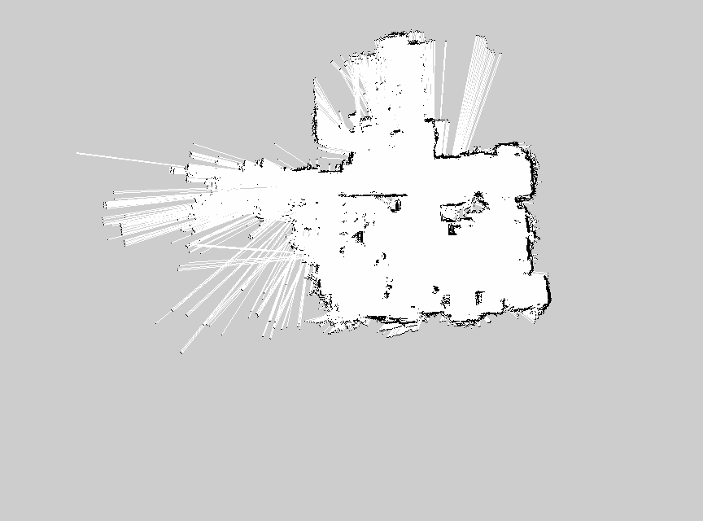
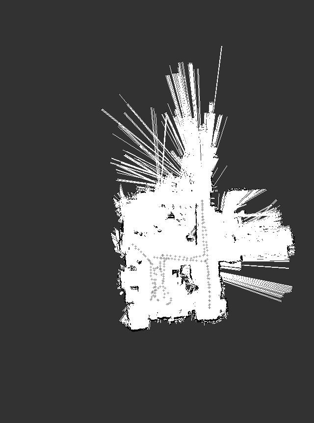

# Robotics Project 2 on ROS

#### Second project of the Robotics course at Politecnico di Milano, academic year 2021 / 2022

<p align="center">
  
  <br>
</p>

### Contributors

- [__Marco D'Antini__](https://github.com/DantiniMarco) (10603556)
- [__Simone Giampà__](https://github.com/SimonGiampy) (10659184)


## Description

The purpose of this project is to use the AMCL algorithm integrated in ROS for the robot localization, and the Gmapping algorithm in ROS for mapping the environment explored.
The data was collected using an omni-directional robot in the AIRLab (Artificial Intelligence and Robotics laboratory) of Politecnico di Milano.
The provided ROS bags contain the robot odometry, 2 LIDAR sensor scans and wheels encoders data.

### Project structure

|Directory|File|Description|
|---------------|---------|-----------|
| /bags |  `robotics1_final.bag` | bag used for mapping with gmapping
|  |  `robotics2_final.bag`| bag used for localization with amcl
|  |  `robotics3_final.bag`| bag used for localization with amcl
| /cfg | `amcl.xml` | configuration file for amcl localization
|  | `gmapping.xml` | configuration file for gmapping
| /launch | `amcl.launch` | launch file for amcl
|  | `gmapping.launch` | launch file for gmapping
|  | `scan_merger.launch` | launch file used to merge the two laser scans, called by both amcl and gmapping
| /maps | `map1.pgm` | the map built with gmapping
|  | `map1.yaml` | metadata of the map
|  | `map_trajectory.png` | two images containing the trajectory drawn on the map
| /rviz | `amcl_cfg.rviz` | rviz configuration file  for amcl
|  | `map_cfg.rviz` | rviz configuration file for gmapping
| /src | `odom_tf2.cpp` | node that does the tf transform from `/odom` topic to `base_link`
| /srv | `TrajectorySrv.srv` | empty service message
| /script | `trajectory_map.py` | script implementing the service that prints the image with map and trajectory

### How to start gmapping

In order to start the Gmapping task for map creation type the following command:

```
roslaunch project2 gmapping.launch bag_file:=robotics1_final
```

this is going to launch the following nodes:
- __gmapping__
- __scan merger__
- the __bag__ player (the bag file name can be modified with the related parameter via terminal)
- the cpp file __odom_tf2__ for the tf transform
- __rviz__ with its configuration

The parameters were left to the default value, except for the LIDAR scans range, set at 16 meters, as described in the LIDAR's datasheet. The changes in the values of the other parameters didn't really improve the final map result.

### How to start AMCL

In order to start all the nodes type the following command:

```
roslaunch project2 amcl.launch bag_file:=robotics2_final
```

this is going to lauch the following nodes:
- __amcl__
- __scan_merger__
- the __bag__ (the bag file name can be modified with the related parameter via terminal)
- the cpp file __odom_tf2__ for the tf transform
- __rviz__ with its configuration
- python script __trajectory_map.py__

The AMCL configuration file uses the beam sensor model for scanning the environment, which proved to be more accurate than the likelihood field model. The other parameters were left to the default value, except for the LIDAR scans range, set at 16 meters, as described in the LIDAR's datasheet.

### Auto-start bags player

These launch files automatically start the bag player. By default, the Gmapping task starts the first bag, while the AMCL task starts the second bag. The bags are stored in the folder "bags" inside the project directory. It is possible to change the bag file to use when launching the project code, by adding this as arguments of the `roslaunch` command, for example add:

```
bag_file:=robotics1_final
```

### Map image Service

We used this command to obtain the .pgm file of the __map__ once gmapping algorithm ended.
```
rosrun map_server map_saver -f map_name
```

### Map with trajectory Service

We decided to write down a __Python script__ to deal with the request of printing the image of the map and trajectory via service.

The script works like following:
- subscribes to the `/map` topic of Rviz and gets the image of the map
- subscribes to the `/amcl_pose` topic of Rviz and gets the __x__ and __y__ coordinates of the amcl algorithm while processing
- for each of these position draws a symbol (__+__) on the image of the map. The image was not initially centered so we calculated some __scaling and traslation__ adjustments to make the position more accurate.

When AMCL has finished running on the bag file, call the service:
```
rosservice call trajectory
```

to save the map with the trajectory. The image is saved in the __/maps folder__, titled "_map_trajectory_"

### Structure of the TF tree

We visualized the structure of the TF tree using to the following command:

```
rosrun rqt_tf_tree rqt_tf_tree
```

Thus, we obtained the following:

<p align="center">
  
  <br>
</p>

The following is the ros graph obtained with `rqt graph` tool :

<p align="center">
  
  <br>
</p>

### Maps

This is the obtained map:
<p align="center">
  
  <br>
</p>

These are the obtained maps with the trajectories drawn over it. The two images are obtained using the map from the first bag file, and the trajectory computed from the /`amcl_pose` computed from the second and third bags.

<p align="center">
  
  <br>
  
</p>
